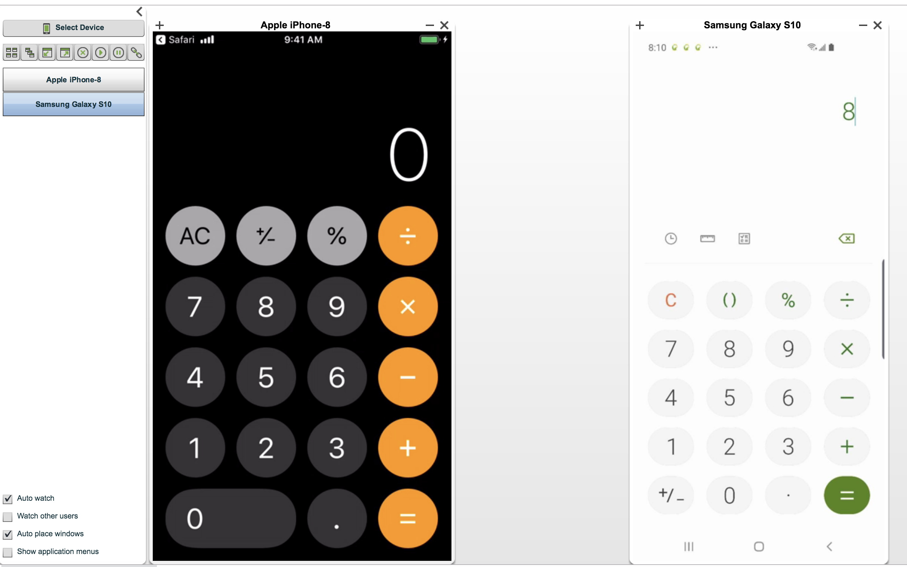
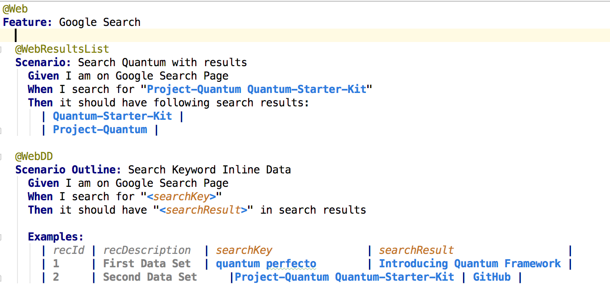
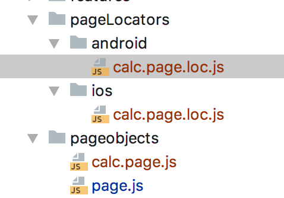
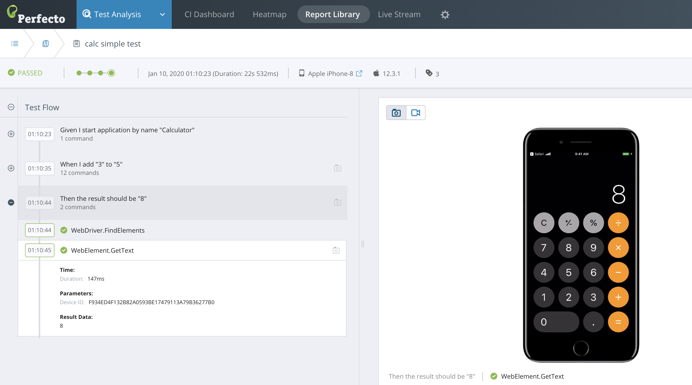

# webdriverio-v5-cucumber-perfecto-sample
This project is useful not only as an example of WebdriverIO v5 and integration with perfecto cloud ([https://www.perfecto.io/]()), but it includes examples of the PageObject pattern, different locators files to run the same script on Android and iOS devices, and some practical examples for using WebdriverIO to build an automated test suite with Cucumber (v 5.x) BDD framework.

<h2>Getting Started</h2>
> git clone https://github.com/PerfectoMobileSA/webdriverio5-cucumber-perfecto-sample.git
 
> cd webdriverio5-cucumber-perfecto-sample

> npm install
> 
> npm run perfecto

<h2> Config Files</h2>
WebdriverIO uses configuration files to setup and execute tests in specific ways. The configuration is fully customizable, and different functions can be invoked before, during and after each test or test suite. 

<h3> Host name and security token </h3>
To integrate and to run your tests on Perfecto cloud, in the config/wdio.perfecto.conf.js file, add your [securityToken](https://developers.perfectomobile.com/display/PD/Generate+security+tokens) and perfecto host name

<h3> Capabilities </h3>
Define your Perfecto devices that will be used during the run. 
For example: 

The scenarios will run on two devices - one samsung (android) device and one iOS device in parallel.

You can read [here](https://developers.perfectomobile.com/display/PD/Define+capabilities) about the capability names you can use. 

<h3> tags </h3>

 
Execute only scenarios with tags matching the expression in the tagExpression key in the cucumberOpts object. 

In wdio version 5.16.15 this key is a string. The key could be changed to array of string ( string[] ) in the next wdio versions.

<h2>Develop automation tests </h2>
<h3> Using Cucumber JavaScript framework </h3>
Tests are written in the Cucumber framework using the Gherkin Syntax. More about Gherkin & Cucumber can be found at [https://cucumber.io/docs/gherkin/reference/](https://cucumber.io/docs/gherkin/reference/)

Tests are place in *.feature files in the /src/features/ directory. A typical test will look similar to this:

<h3> Page Object and Page Locators </h3>
The page object pattern helps us to reduces the amount of duplicated code and if the UI changes, the fix need only be applied in one place. Instead of including our selectors (classes, id's, or xpath' etc.) in our step definitions, we instead place them in a `<pagename>.js` file where we can manage all these selectors,reusable functions and logic together. Your test file should only call the test methods.

The page object serves as a layer of abstraction between tests and code. When A test fails, it fails on an individual step. That step may call a selector that is no longer valid, but that selector may be used by many other steps. By having a single source of truth of what the selector is supposed to be, fixing one selector on the page object could repair a number of failing tests that were affected by the same selector.

It is preferable to separate page objects into individual files that end with `.page.js`. These will require the basic `page.js `prototype construct / abstract class and create new objects for each individual page.
Pages are place in *.page.js files in the /src/pageobjects/ directory

The selectors for each platform (android or iOS) are placed in the **Page Locator** files. 
During run time, the page object points to the correct page locater object according to the platform that is running. 
Page locator name should be the same name as its page object end with `.page.loc.js`. 
For example, for the calc.page.js file, there are two locators files: /src/pageLocators/android/calc.page.loc.js and /src/pageLocators/ios/calc.page.loc.js

   
<h2> Reports </h2>
After you run the scripts, you can access the results in the [Perfecto CI Dashboard view](https://developers.perfectomobile.com/display/PD/CI+Dashboard+view), as shown in the following image.

In the [Single Test Report (STR)](https://developers.perfectomobile.com/pages/viewpage.action?pageId=31104900), view the test flow with individual steps, as shown in the following image.
